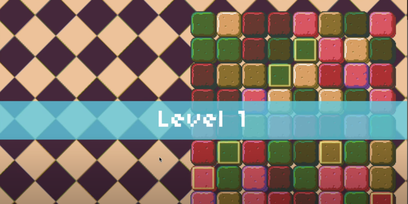

# Match-3

A Bejeweled-style tile matching puzzle game built with LÖVE2D for CS50's Game Development course.



## Description

Match-3 is a colorful grid-based puzzle game inspired by Bejeweled. Players swap adjacent tiles to create horizontal or vertical matches of 3 or more. This project explores match detection, tile swapping, and animated transitions.

Features include:

- Match detection and cascading
- Swapping tiles with animation
- Multiple tile varieties and shiny tiles
- Timer-based gameplay with scoring
- Background music and sound effects

## How to Play

### Controls

- `Arrow Keys`: Move cursor  
- `Enter`: Select or swap tiles  

### Objective

Match 3 or more tiles of the same type to score points and extend your timer. Matches trigger tile destruction and cascade new tiles from above. Game ends when time runs out.

## Development

### Built With

- [LÖVE2D](https://love2d.org/) — 2D game framework  
- Lua — Programming language  
- State machine and animation system  
- Knife behavior toolkit (utility library used for effects and logic)

### Project Structure

- `main.lua` — Game entry point  
- `src/` — Core logic, board, tiles, and states  
- `lib/` — External libraries (push, class, and knife)  
- `graphics/` — Backgrounds, tiles, effects  
- `fonts/` — Pixel font used in UI  
- `sounds/` — Music and sound effects

## Installation and Running

1. [Download and install LÖVE2D](https://love2d.org/)
2. Clone the repository:
   ```bash
   git clone https://github.com/ethanperello/match-3.git
   ```
3. Run the game:
   ```bash
   love match-3
   ```

## Demo

[Watch the gameplay demo](https://www.youtube.com/watch?v=uRAvr6jjvD4&t=2s)

## Credits

- Developed by Ethan Perello  
- Created as part of CS50's Game Development course  
- Sound and visual inspiration from Bejeweled and match-3 genre classics
